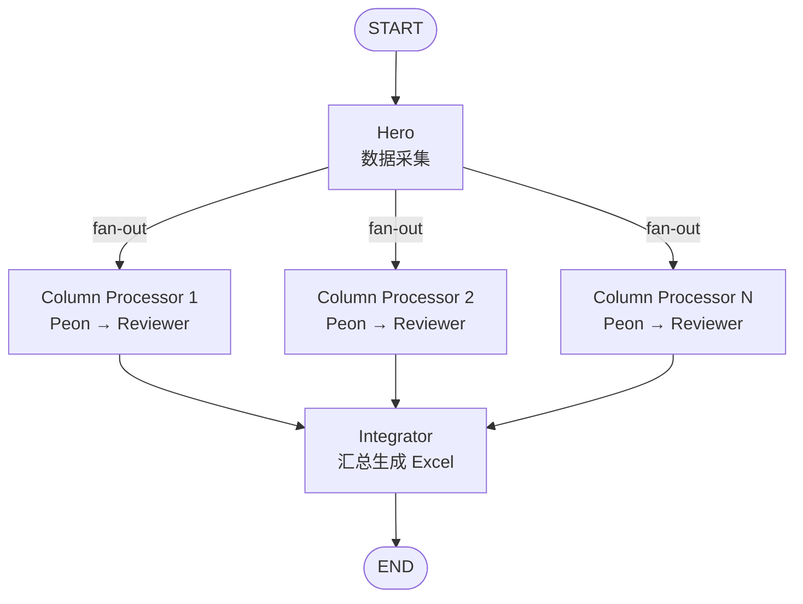

# Lumen — Release Note 生成工作流

基于 [LangGraph](https://github.com/langchain-ai/langgraph) 构建的多 Agent 工作流，根据配置的仓库地址和版本周期，自动获取提交/MR 信息，通过动态创建的 Peon/Reviewer Agent 对并行处理各 RN 列，最终生成 Excel 文件。

支持：

- 可配置的 RN 列定义（每列对应独立的 Peon + Reviewer）
- 每个 Agent 可独立配置提示词和模型
- 版本周期自动计算（默认每月 7 号转测、15 号发布）
- MR 平台抽象接口（当前提供 Mock 实现，可扩展 GitLab/GitHub）
- Reviewer 拒绝后自动重试，反馈传递给 Peon 修正输出
- Agent 思考过程流式展示
- CLI 命令行与 LangGraph Studio 两种调试方式

---

## 工作流概览



### 各 Agent 职责

| Agent | 职责 |
|-------|------|
| **Hero** | 加载 RN 配置，计算版本周期日期范围，获取 git commits 和 MR 列表 |
| **Peon** | 根据 column_config 动态加载提示词和模型，处理单个 RN 列（如提取机制变更、判断开源同步等） |
| **Column Reviewer** | 审核 Peon 输出是否准确完整；拒绝时提供反馈，Peon 根据反馈重试 |
| **Integrator** | 收集所有列结果，生成 Excel 文件 |

### 关键设计原则

1. **Fan-out 并行处理**：每个 RN 列通过 LangGraph `Send` 并行分发到独立的 `column_processor`，各列互不阻塞。
2. **Peon→Reviewer 内部循环**：`column_processor` 在单个节点内实现 peon→reviewer 循环，避免子图嵌套。Reviewer 拒绝后，反馈传递给下一次 Peon 尝试。
3. **动态 Agent 配置**：每列的 Peon/Reviewer 通过 `rn_config.json` 独立配置提示词、模型和温度，无需改代码。
4. **MR 平台可扩展**：`MRPlatform` 抽象接口 + `MockMRPlatform` 实现，可通过 `register_platform()` 注册 GitLab/GitHub 适配器。

---

## 项目结构

```
Lumen/
├── main.py                      # CLI 入口
├── config.py                    # 全局配置：LLM 初始化、Prompt 加载
├── langgraph.json               # LangGraph dev / Studio 配置文件
├── pyproject.toml               # Python 包定义
├── requirements.txt             # 运行时依赖
├── requirements-dev.txt         # 开发依赖（含 langgraph-cli）
├── rn_config.example.json       # RN 配置示例
├── .env.example                 # 环境变量模板
│
├── agents/                      # Agent 节点实现
│   ├── hero.py                  # Hero 节点：加载配置、获取 commits/MRs
│   ├── peon.py                  # 通用 Peon Agent，根据 column_config 动态配置
│   ├── column_reviewer.py       # 通用 Reviewer Agent
│   ├── column_processor.py      # 列处理器：peon → reviewer 循环
│   ├── integrator.py            # Integrator 节点：汇总结果生成 Excel
│   ├── llm_display.py           # LLM 流式输出与 thinking 展示
│   └── parsers.py               # 解析 LLM 输出中的结构化标记
│
├── graph/                       # LangGraph 图定义
│   ├── rn_state.py              # RNWorkflowState 类型定义
│   ├── rn_router.py             # 条件路由与 Send fan-out 分发
│   └── rn_workflow.py           # 构建 StateGraph，导出 rn_graph
│
├── tools/                       # 工具
│   ├── git_tools.py             # git_log / git_diff_commits / git_diff_repos
│   ├── mr_platform.py           # MR 平台抽象接口 + Mock 实现
│   └── excel_tools.py           # write_excel（openpyxl）
│
├── prompts/                     # 各 Agent 的 System Prompt
│   └── rn/                      # RN 相关提示词
│       ├── hero.md
│       ├── mechanism_changes_peon.md
│       ├── mechanism_changes_reviewer.md
│       ├── open_source_sync_peon.md
│       └── open_source_sync_reviewer.md
│
├── test_rn_verify.py            # 组件测试
├── test_rn_integration.py       # 集成测试
│
└── .githooks/                   # Git commit-msg hook
    └── commit-msg
```

---

## 使用方法

### 环境准备

```bash
pip install -r requirements.txt
cp .env.example .env
# 编辑 .env，填入 OPENAI_API_KEY 等
```

### CLI 命令行

**全量生成：**

```bash
python3 main.py --repo /path/to/repo --version 2024-06 --config rn_config.json
```

**增量更新：**

```bash
python3 main.py --repo /path/to/repo --version 2024-06 --config rn_config.json \
    --mode incremental --existing-excel release_note.xlsx
```

增量模式下，工作流会：
1. 读取已有 Excel，提取最后一条 commit hash
2. 使用 `git log <hash>..HEAD` 仅获取新增 commits
3. 仅对新增 commits 执行 Peon/Reviewer 处理
4. 将新结果与旧数据合并，旧 commits 的列值保留不动

参数说明：

| 参数 | 必填 | 说明 |
|------|------|------|
| `--repo` | 是 | 仓库 URL 或本地路径 |
| `--version` | 是 | 版本周期标识（如 `2024-06`） |
| `--config` | 否 | RN 配置文件路径，默认 `rn_config.json` |
| `--mode` | 否 | 生成模式：`full`（全量）或 `incremental`（增量），默认 `full` |
| `--existing-excel` | 否 | 增量模式下的已有 Excel 文件路径（默认使用配置中的 `output_path`） |

### LangGraph Studio 调试

```bash
langgraph dev
```

启动后在 Studio 中选择 graph **`rn`**。

### 运行测试

```bash
python3 test_rn_verify.py
python3 test_rn_integration.py
```

---

## RN 配置文件

配置文件为 JSON 格式，示例见 `rn_config.example.json`。主要字段：

```json
{
  "version_cycle": {
    "test_cutoff_day": 7,
    "release_day": 15
  },
  "repo": {
    "url": "https://gitlab.example.com/team/project",
    "local_path": "/path/to/local/repo",
    "open_source_repo_path": "/path/to/open-source/repo"
  },
  "mr_platform": {
    "type": "mock",
    "data_path": "mock_mr_data.json",
    "project_id": ""
  },
  "rn_columns": [...],
  "excel": {
    "output_path": "release_note.xlsx",
    "sheet_name": "Release Note"
  },
  "workflow": {
    "max_retries": 3
  },
  "incremental": {
    "existing_excel_path": "release_note.xlsx"
  }
}
```

### 版本周期计算

以 `version_cycle = "2024-06"` 为例：
- **起始日期**：上月 `release_day + 1` → `2024-05-16`
- **截止日期**：本月 `test_cutoff_day` → `2024-06-07`

### RN 列定义

每列定义独立的 Peon 和 Reviewer：

```json
{
  "id": "mechanism_changes",
  "name": "机制变更说明",
  "description": "从 MR 信息中提取机制变更说明",
  "peon": {
    "prompt_file": "prompts/rn/mechanism_changes_peon.md",
    "model_name": "gpt-4o",
    "temperature": 0
  },
  "reviewer": {
    "prompt_file": "prompts/rn/mechanism_changes_reviewer.md",
    "model_name": "gpt-4o-mini",
    "temperature": 0
  }
}
```

---

## 如何修改 / 扩展

### 新增 RN 列

1. 在 `prompts/rn/` 下新建 peon 和 reviewer 提示词文件
2. 在 `rn_config.json` 的 `rn_columns` 数组中添加列定义

### 新增 MR 平台

```python
from tools.mr_platform import MRPlatform, register_platform

class GitLabMRPlatform(MRPlatform):
    def fetch_mrs(self, project_id, since, until):
        ...

register_platform("gitlab", GitLabMRPlatform)
```

然后在配置中设置 `"mr_platform": {"type": "gitlab", ...}`。

### 修改 Agent 提示词

直接编辑 `prompts/rn/` 下对应的 Markdown 文件。提示词中使用 `RESULT:`、`REVIEW:` 等标记时，需同步确认 `agents/parsers.py` 中的解析逻辑能正确识别。

---

## 环境变量

| 变量 | 说明 | 默认值 |
|------|------|--------|
| `OPENAI_API_KEY` | LLM API Key | （必填） |
| `OPENAI_BASE_URL` | API 基础 URL | 无 |
| `MODEL_NAME` | 默认模型名称 | `gpt-4o-mini` |
| `TEMPERATURE` | 默认采样温度 | `0` |

每列的 Peon/Reviewer 可通过 `rn_config.json` 中的 `model_name`、`temperature`、`api_key`、`base_url` 独立覆盖。

---

## 常见问题

**Q: 如何安装 Git commit Signed-off-by hook？**

```bash
cp .githooks/commit-msg .git/hooks/commit-msg && chmod +x .git/hooks/commit-msg
```

**Q: Mock MR 平台如何使用？**

在 `rn_config.json` 中设置 `"mr_platform": {"type": "mock", "data_path": "path/to/mr_data.json"}`，MR 数据文件格式为 JSON 数组，每个元素包含 `id`、`title`、`description`、`author`、`labels`、`source_branch`、`target_branch`、`merged_at` 字段。
