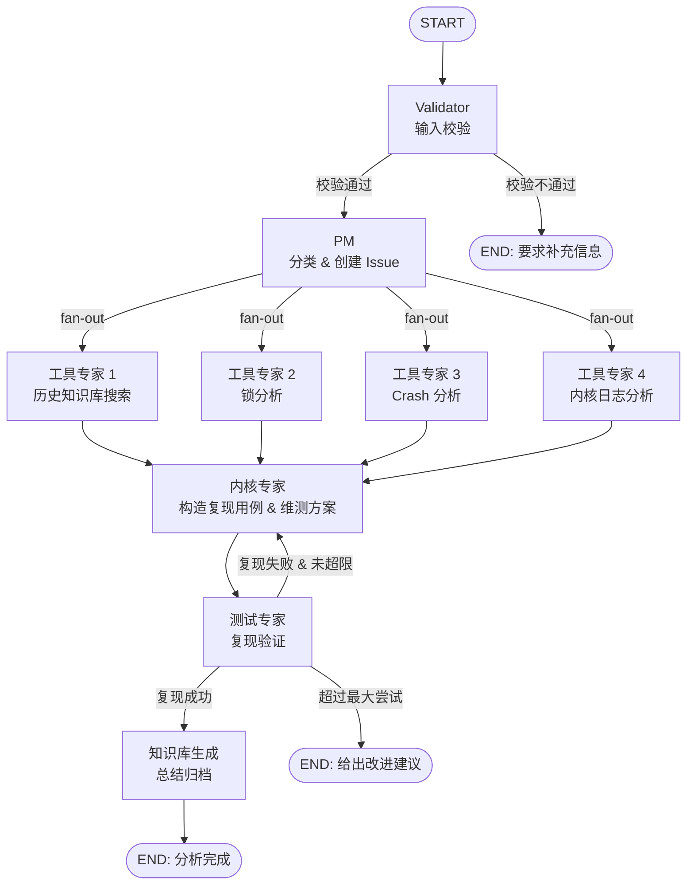

# Lumen — 维护接口人工作流

基于 [LangGraph](https://github.com/langchain-ai/langgraph) 构建的多 Agent 工作流，用于自动化处理内核维护问题。用户提交问题描述后，工作流自动校验、分类、分析、验证并归档，形成完整的维护闭环。

---

## 工作流概览



### 各 Agent 职责

| Agent | 职责 |
|-------|------|
| **Validator** | 校验用户输入信息是否完备，不完整则要求补充 |
| **PM** | 分析问题类型，分类交给对应工具专家，创建 issue 跟踪 |
| **工具专家** | 根据专业领域进行初步分析（历史知识库搜索、锁分析、Crash 分析、内核日志分析） |
| **内核专家** | 综合工具专家输出，结合代码分析，构造必现用例并给出内核维测方案 |
| **测试专家** | 根据复现用例验证问题，成功则归档，失败则反馈给内核专家重新分析，超限则给出改进建议直接结束 |
| **知识库生成** | 将问题总结为知识库文档归档 |

### 关键设计原则

1. **输入校验前置**：Validator 确保信息完备后才进入分析流程，避免无效分析
2. **Fan-out 并行分析**：多个工具专家通过 LangGraph `Send` 并行执行，互不阻塞
3. **内核专家 ⇄ 测试专家循环**：测试失败时反馈给内核专家重新分析，直到复现成功或超过最大尝试次数；超限时跳过知识库生成，直接给出改进建议（环境、信息、分析思路、维测方案）结束流程
4. **工具专家可配置**：通过 JSON 配置文件定义工具专家类型和参数，无需改代码即可扩展
5. **知识库自动归档**：分析完成后自动生成知识库文档，积累维护经验

---

## 项目结构

```
Lumen/
├── main.py                              # CLI 入口
├── config.py                            # 全局配置：LLM 初始化、Prompt 加载
├── langgraph.json                       # LangGraph dev / Studio 配置文件
├── maintenance_config.example.json       # 工作流配置示例
├── requirements.txt                     # 运行时依赖
│
├── agents/                              # Agent 节点实现
│   ├── validator.py                     # Validator：校验用户输入
│   ├── pm.py                            # PM：问题分类 & 创建 issue
│   ├── tool_expert.py                   # 工具专家：按类型执行专业分析
│   ├── kernel_expert.py                 # 内核专家：构造复现用例 & 维测方案
│   ├── test_expert.py                   # 测试专家：复现验证
│   ├── knowledge_base.py               # 知识库生成：总结归档
│   └── llm_display.py                   # LLM 流式输出与 thinking 展示
│
├── graph/                               # LangGraph 图定义
│   ├── rn_state.py                      # MaintenanceWorkflowState 类型定义
│   ├── rn_router.py                     # 条件路由与 Send fan-out 分发
│   └── rn_workflow.py                   # 构建 StateGraph，导出 maintenance_graph
│
├── prompts/                             # 各 Agent 的 System Prompt
│   └── maintenance/
│       ├── validator.md                 # Validator 提示词
│       ├── pm.md                        # PM 提示词
│       ├── knowledge_search.md          # 历史知识库搜索专家提示词
│       ├── lock_analysis.md             # 锁分析专家提示词
│       ├── crash_analysis.md            # Crash 分析专家提示词
│       ├── kernel_log_analysis.md       # 内核日志分析专家提示词
│       ├── kernel_expert.md             # 内核专家提示词
│       ├── test_expert.md               # 测试专家提示词
│       └── knowledge_base.md            # 知识库生成提示词
│
└── .githooks/                           # Git commit-msg hook
    └── commit-msg
```

---

## 使用方法

### 环境准备

```bash
pip install -r requirements.txt
cp maintenance_config.example.json maintenance_config.json
# 编辑 maintenance_config.json，填入 default.api_key 等
```

### CLI 命令行

```bash
python3 main.py --input "问题描述" --config maintenance_config.json
```

参数说明：

| 参数 | 必填 | 说明 |
|------|------|------|
| `--input` | 是 | 用户输入的问题描述 |
| `--config` | 否 | 工作流配置文件路径，默认 `maintenance_config.json` |

### LangGraph Studio 调试

```bash
langgraph dev
```

启动后在 Studio 中选择 graph **`maintenance`**。

---

## 配置文件

配置文件为 JSON 格式，示例见 `maintenance_config.example.json`。主要字段：

```json
{
  "default": {
    "api_key": "your-api-key-here",
    "base_url": "https://api.openai.com/v1",
    "model_name": "gpt-4o-mini",
    "temperature": 0
  },
  "agents": {
    "validator": {
      "prompt_file": "prompts/maintenance/validator.md",
      "model_name": "gpt-4o-mini",
      "temperature": 0
    },
    "pm": { ... },
    "kernel_expert": { ... },
    "test_expert": { ... },
    "knowledge_base": { ... }
  },
  "tool_experts": [
    {
      "type": "knowledge_search",
      "name": "历史知识库搜索专家",
      "description": "搜索历史知识库，查找与当前问题相似的历史案例和解决方案",
      "agent": {
        "prompt_file": "prompts/maintenance/knowledge_search.md",
        "model_name": "gpt-4o",
        "temperature": 0
      }
    }
  ],
  "knowledge_base": {
    "output_dir": "knowledge_base"
  },
  "workflow": {
    "max_test_attempts": 3
  }
}
```

### 默认配置

`default` 块定义全局默认值，所有 Agent 未单独配置时自动回退：

| 字段 | 说明 |
|------|------|
| `api_key` | LLM API Key（必填） |
| `base_url` | API 基础 URL |
| `model_name` | 默认模型名称 |
| `temperature` | 默认采样温度 |

### Agent 配置

每个 Agent 可独立配置：

| 字段 | 说明 |
|------|------|
| `prompt_file` | 系统提示词文件路径 |
| `model_name` | 使用的模型名称 |
| `temperature` | 采样温度 |
| `api_key` | 独立 API Key（可选，默认使用 default.api_key） |
| `base_url` | 独立 API Base URL（可选，默认使用 default.base_url） |

### 工具专家配置

`tool_experts` 数组定义可用的工具专家，每个专家包含：

| 字段 | 说明 |
|------|------|
| `type` | 专家类型标识（用于路由） |
| `name` | 专家显示名称 |
| `description` | 专家职责描述（PM 据此选择专家） |
| `agent` | Agent 配置（同上） |

### 新增工具专家

1. 在 `prompts/maintenance/` 下新建提示词文件
2. 在配置文件的 `tool_experts` 数组中添加专家定义
3. 无需修改代码

---

## 常见问题

**Q: 如何安装 Git commit Signed-off-by hook？**

```bash
cp .githooks/commit-msg .git/hooks/commit-msg && chmod +x .git/hooks/commit-msg
```

**Q: 如何调整测试验证的最大尝试次数？**

在配置文件的 `workflow.max_test_attempts` 中修改，默认为 3 次。

**Q: Issue 创建功能何时可用？**

当前 Issue 创建为打桩实现，后续将补充具体的 Issue 跟踪系统集成。
