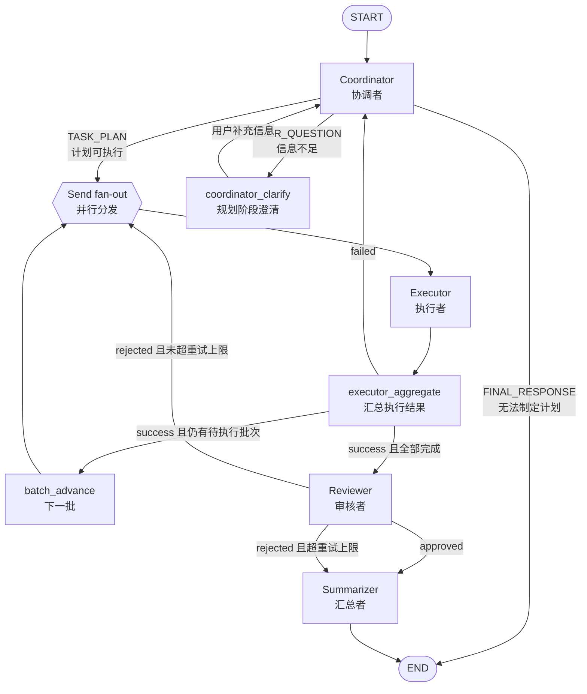

# Lumen — 项目例行多 Agent 工作流

基于 [LangGraph](https://github.com/langchain-ai/langgraph) 构建的四 Agent 协作工作流，用于处理项目例行任务（读文件、执行命令、代码搜索等）。

工作流由 **Coordinator（协调者）**、**Executor（执行者）**、**Reviewer（审核者）**、**Summarizer（汇总者）** 四个 Agent 组成，支持：

- 子任务并发执行（LangGraph Send fan-out）
- 任务制定阶段的用户澄清（Human-in-the-loop）
- 执行与审核阶段全自动运行（不再向用户提问）
- Agent 思考过程流式展示
- CLI 命令行与 LangGraph Studio 两种调试方式

---

## 工作流概览



### 各 Agent 职责

| Agent | 职责 | 是否可与用户交互 |
|-------|------|------------------|
| **Coordinator** | 理解用户指令、制定任务计划、规划阶段澄清；执行失败时重新规划 | ✅ 仅任务制定阶段 |
| **Executor** | 调用工具执行文件读写、命令、代码搜索；多个子任务通过 Send 并行 fan-out | ❌ |
| **Reviewer** | 审核执行结果是否符合预期，不通过则反馈重试 | ❌ |
| **Summarizer** | 审核完成（通过或重试超限）后汇总执行结果，生成面向用户的最终回复 | ❌ |

### 关键设计原则

1. **用户交互仅发生在任务制定阶段**：Coordinator 信息不足时使用 `USER_QUESTION` 向用户澄清；无法形成可执行计划时直接 `FINAL_RESPONSE` 结束，不交给 Executor。
2. **Executor 不得向用户提问**：遇到阻碍时使用 `STATUS: failed` 报告，由 Coordinator 自动重新规划（不再询问用户）。
3. **子任务并行执行**：Coordinator 在 `TASK_PLAN` 中用编号列表（`1.` `2.` …）输出多个子任务；解析器拆分为完整 `task_items` 列表。每批最多 `MAX_PARALLEL_TASKS`（默认 5）个子任务通过 LangGraph `Send` 并行 fan-out；一批完成后由 `batch_advance` 推进下一批，**全部子任务执行完毕**后 `executor_aggregate` 汇总，再进入 Reviewer。
4. **Reviewer 拒绝后自动重试**：最多重试 3 次（`config.py` 中 `MAX_RETRIES`），超限后 Summarizer 强制汇总。重试时从第一批重新执行全部子任务。
5. **并发批次上限**：`config.py` 中 `MAX_PARALLEL_TASKS`（默认 5）控制**每批**并发子任务数，不限制计划中的子任务总数。

---

## 项目结构

```
Lumen/
├── main.py                      # CLI 入口，命令行运行工作流
├── config.py                    # 全局配置：LLM 初始化、Prompt 加载、重试/并发上限
├── langgraph.json               # LangGraph dev / Studio 配置文件
├── pyproject.toml               # Python 包定义（langgraph dev 依赖解析）
├── requirements.txt             # 运行时依赖
├── requirements-dev.txt         # 开发依赖（含 langgraph-cli）
├── studio_input.example.json    # LangGraph Studio 初始输入示例
├── .env.example                 # 环境变量模板
│
├── agents/                      # Agent 节点实现
│   ├── coordinator.py           # Coordinator + coordinator_clarify 节点逻辑
│   ├── executor.py              # Executor 节点：单个子任务的 ReAct 工具循环
│   ├── executor_aggregate.py    # 汇总执行结果；batch_advance 推进下一批子任务
│   ├── reviewer.py              # Reviewer 节点：审核执行结果
│   ├── summarizer.py            # Summarizer 节点：生成最终用户回复
│   ├── llm_display.py           # LLM 流式输出与 thinking 展示工具
│   └── parsers.py               # 解析 LLM 输出中的结构化标记
│
├── graph/                       # LangGraph 图定义
│   ├── state.py                 # 共享状态 WorkflowState 类型定义
│   ├── router.py                # 条件路由与 Send fan-out 分发
│   └── workflow.py              # 构建 StateGraph，导出 graph 供 Studio 使用
│
├── tools/                       # Executor 可用工具
│   └── project_tools.py         # read_file / write_file / run_shell_command / search_code
│
├── prompts/                     # 各 Agent 的 System Prompt
│   ├── coordinator.md
│   ├── executor.md
│   ├── reviewer.md
│   └── summarizer.md
│
├── test_integration.py          # 集成测试（Mock LLM，验证主路径含并发执行）
├── test_verify.py               # 组件测试（解析器、工具、路由、图编译）
│
└── .githooks/                   # Git commit-msg hook（自动追加 Signed-off-by）
    └── commit-msg
```

---

## 文件说明

### 根目录

| 文件 | 作用 |
|------|------|
| `main.py` | CLI 入口。读取用户指令，启动工作流，处理规划阶段的 interrupt 恢复，打印最终回复。本地运行时使用 `MemorySaver` 作为 checkpointer。 |
| `config.py` | 加载 `.env`，提供 `get_llm(agent)` 按 Agent 创建 LLM 客户端（支持独立 model/api/temperature），`load_prompt()` 读取 `prompts/` 下的 Markdown 文件；`MAX_RETRIES` 控制审核重试上限，`MAX_PARALLEL_TASKS` 控制每批并发子任务数（超出部分排队分批执行）。 |
| `langgraph.json` | LangGraph dev 配置：指定 graph 路径、依赖、环境变量文件。运行 `langgraph dev` 时使用。 |
| `pyproject.toml` | Python 包元数据，`langgraph dev` 通过 `"dependencies": ["."]` 安装本项目。 |
| `requirements.txt` | 运行时 pip 依赖。 |
| `requirements-dev.txt` | 开发依赖，包含 `langgraph-cli[inmem]`。 |
| `studio_input.example.json` | 在 LangGraph Studio 中发起运行时的初始 State 示例，可直接复制粘贴。 |
| `.env.example` | 环境变量模板，复制为 `.env` 后填入 API Key。 |

### `agents/` — Agent 节点

| 文件 | 作用 |
|------|------|
| `coordinator.py` | 实现 `coordinator_node` 和 `coordinator_clarify_node`。负责规划、澄清、重规划；将 `TASK_PLAN` 解析为 `task_items` 供并发执行。 |
| `executor.py` | 实现 `executor_node`。每次只执行一个子任务（`current_task`），绑定 `project_tools`，通过 ReAct 循环（最多 10 轮）完成操作。 |
| `executor_aggregate.py` | 实现 `executor_aggregate_node` 与 `batch_advance_node`。每批 Executor 完成后合并 `execution_results`；若仍有待执行批次则推进 `task_batch_offset` 并继续 fan-out，全部完成后才交给 Reviewer。 |
| `reviewer.py` | 实现 `reviewer_node`。对照用户需求和任务计划审核汇总后的执行结果，输出 approved / rejected。 |
| `summarizer.py` | 实现 `summarizer_node`。审核完成后汇总全部信息，生成 `final_response`。 |
| `llm_display.py` | 封装 `call_llm_with_display()`，流式打印 Agent 思考过程；支持模型原生 `reasoning_content` 字段；Executor 工具调用日志也在这里输出。 |
| `parsers.py` | 从 LLM 文本输出中提取 `TASK_PLAN:`、`USER_QUESTION:`、`FINAL_RESPONSE:`、`STATUS:`、`REVIEW:` 等标记；`parse_task_items()` 将计划拆分为子任务列表。 |

### `graph/` — 图结构

| 文件 | 作用 |
|------|------|
| `state.py` | 定义 `WorkflowState`，包含 `user_request`、`task_plan`、`task_items`、`execution_results`、`execution_result` 等字段。修改状态结构时先改此文件。 |
| `router.py` | 条件路由函数与 `dispatch_executors()`（Send fan-out）；决定每个节点执行完后的下一个节点或并行分支。 |
| `workflow.py` | 组装 `StateGraph`，注册 Coordinator / Executor / executor_aggregate / Reviewer / Summarizer 等节点；文件末尾的 `graph` 变量供 LangGraph Studio 加载。 |

### `tools/` — 执行工具

| 文件 | 作用 |
|------|------|
| `project_tools.py` | 四个 LangChain `@tool`：`read_file`、`write_file`、`run_shell_command`（白名单限制）、`search_code`。Executor 通过 `PROJECT_TOOLS` 列表绑定这些工具。 |

### `prompts/` — System Prompt

| 文件 | 作用 |
|------|------|
| `coordinator.md` | Coordinator 的角色、约束和输出格式（`THINKING:` / `TASK_PLAN:` / `USER_QUESTION:` / `FINAL_RESPONSE:`）；多步骤计划须用编号列表。 |
| `executor.md` | Executor 的角色、约束和输出格式（`THINKING:` / `STATUS: success|failed`）；每次只执行一个子任务。 |
| `reviewer.md` | Reviewer 的角色、约束和输出格式（`THINKING:` / `REVIEW: approved|rejected`）。 |
| `summarizer.md` | Summarizer 的角色、约束和输出格式（`THINKING:` / `FINAL_RESPONSE:`）。 |

---

## 如何修改 / 扩展

### 修改 Agent 提示词

直接编辑 `prompts/` 下对应的 Markdown 文件，无需改代码。`config.py` 中的 `load_prompt()` 会在运行时读取最新内容。

```
prompts/
├── coordinator.md   ← 改协调者行为
├── executor.md      ← 改执行者行为
├── reviewer.md      ← 改审核者行为
└── summarizer.md    ← 改汇总者行为
```

提示词中使用 `THINKING:`、`TASK_PLAN:` 等标记时，需同步确认 `agents/parsers.py` 中的解析逻辑能正确识别。

### 新增工具（供 Executor 使用）

1. 在 `tools/project_tools.py` 中用 `@tool` 装饰器定义新函数。
2. 将新工具加入文件末尾的 `PROJECT_TOOLS` 列表。
3. 在 `prompts/executor.md` 的「可用工具」章节补充说明。

```python
@tool
def my_new_tool(param: str) -> str:
    """工具描述（LLM 可见）。"""
    ...

PROJECT_TOOLS = [read_file, write_file, run_shell_command, search_code, my_new_tool]
```

### 新增节点

以新增一个 `validator` 节点为例，需修改以下文件：

**1. 定义节点函数** — 在 `agents/` 下新建：

```python
# agents/validator.py
def validator_node(state: WorkflowState) -> dict:
    ...
    return {"validation_status": "passed"}
```

**2. 扩展状态（如需要）** — 编辑 `graph/state.py`，在 `WorkflowState` 中添加字段。

**3. 添加路由** — 编辑 `graph/router.py`，新增或修改路由函数，决定何时进入新节点。

**4. 注册到图** — 编辑 `graph/workflow.py`：

```python
from agents.validator import validator_node

builder.add_node("validator", validator_node)
builder.add_conditional_edges("executor_aggregate", route_after_executor_aggregate)  # 修改路由
builder.add_edge("validator", "reviewer")
```

**5. 添加 Prompt（如有 LLM 调用）** — 在 `prompts/` 下新建 `validator.md`，在节点中通过 `load_prompt("validator")` 加载。

> 若新节点需要并行 fan-out，参考 `graph/router.py` 中的 `dispatch_executors()` 与 LangGraph `Send` API。

### 修改路由逻辑

编辑 `graph/router.py`。路由函数读取 `state` 中的状态字段（如 `next_node`、`executor_status`、`review_status`），返回下一个节点名称、`END`，或通过 `Send` 返回并行分支列表。

Coordinator 与 Reviewer 的重试路径通过 `dispatch_executors()` 向 Executor fan-out；每批子任务完成后由 `executor_aggregate` 检查是否还有 `batch_advance` 待执行批次，**全部子任务完成后**才 fan-in 进入 Reviewer 或 Coordinator（失败时）。

节点函数通过设置 `next_node` 字段来影响 Coordinator 的路由：

| `next_node` 值 | 行为 |
|----------------|------|
| `"executor"` | 通过 `dispatch_executors()` Send fan-out 到 Executor |
| `"clarify"` | 进入 coordinator_clarify（等待用户输入） |
| `"end"` | 结束工作流 |
| `"coordinator"` | 回到 Coordinator（由 clarify 节点设置） |

### 修改 LLM 配置

编辑 `.env` 文件。各 Agent 可单独配置 model、api_key、base_url、temperature；未设置的项回退到全局默认值。

```env
# 全局默认
OPENAI_API_KEY=your-api-key
OPENAI_BASE_URL=https://api.openai.com/v1
MODEL_NAME=gpt-4o-mini
TEMPERATURE=0

# 按 Agent 覆盖（可选）
COORDINATOR_MODEL_NAME=gpt-4o
COORDINATOR_TEMPERATURE=0.2

EXECUTOR_MODEL_NAME=deepseek-chat
EXECUTOR_API_KEY=sk-...
EXECUTOR_BASE_URL=https://api.deepseek.com/v1
EXECUTOR_TEMPERATURE=0

REVIEWER_TEMPERATURE=0
SUMMARIZER_MODEL_NAME=gpt-4o-mini
SUMMARIZER_TEMPERATURE=0.3
```

代码中通过 `get_llm("coordinator")`、`get_llm("executor")` 等获取对应客户端。

---

## 使用方法

### 环境准备

```bash
# 安装运行时依赖
pip install -r requirements.txt

# 安装开发依赖（含 langgraph-cli，用于 Studio 调试）
pip install -r requirements-dev.txt

# 配置环境变量
cp .env.example .env
# 编辑 .env，填入 OPENAI_API_KEY 等
```

### 方式一：CLI 命令行

```bash
# 交互式输入指令
python3 main.py

# 直接传入指令
python3 main.py "读取 main.py 并统计行数"

# 检查项目结构并生成报告
python3 main.py "检查项目结构并生成简要报告"
```

运行过程中：

- 各 Agent 的思考过程会**流式打印**到终端
- 若 Coordinator 输出多个子任务，各 Executor 分支会**并行**流式打印到终端
- 若 Coordinator 在规划阶段需要澄清，会提示 `[任务规划] 需要您的输入:`，输入后自动继续
- 执行和审核阶段无需人工介入

### 方式二：LangGraph Studio 调试

```bash
# 启动本地开发服务器
langgraph dev

# 不自动打开浏览器
langgraph dev --no-browser
```

启动后终端会输出：

```
- API:      http://127.0.0.1:2024
- Studio:   https://smith.langchain.com/studio/?baseUrl=http://127.0.0.1:2024
- API Docs: http://127.0.0.1:2024/docs
```

在 Studio 中：

1. 选择 graph **`ewel`**
2. 在 Input 面板粘贴 `studio_input.example.json` 中的内容，修改 `user_request` 字段
3. 点击运行，可可视化查看每个节点的输入/输出
4. 遇到 `coordinator_clarify` 节点的 interrupt 时，在 Studio 界面中填写用户回复并 Resume

> **注意**：`langgraph dev` 模式下持久化由平台自动管理，不需要（也不允许）自定义 checkpointer。CLI 模式（`main.py`）使用 `MemorySaver` 以支持 interrupt 恢复。

### 运行测试

```bash
# 组件测试（无需 API Key）
python3 test_verify.py

# 集成测试（Mock LLM，验证主路径含并发执行）
python3 test_integration.py
```

---

## 环境变量

### 全局默认

| 变量 | 说明 | 示例 |
|------|------|------|
| `OPENAI_API_KEY` | LLM API Key | `sk-...` |
| `OPENAI_BASE_URL` | API 基础 URL（兼容 OpenAI 格式的服务） | `https://api.openai.com/v1` |
| `MODEL_NAME` | 默认模型名称 | `gpt-4o-mini` |
| `TEMPERATURE` | 默认采样温度 | `0` |

### 按 Agent 覆盖（可选）

前缀为 `COORDINATOR`、`EXECUTOR`、`REVIEWER`、`SUMMARIZER`，每个 Agent 支持：

| 变量 | 说明 |
|------|------|
| `{AGENT}_MODEL_NAME` | 模型名称，未设置则用 `MODEL_NAME` |
| `{AGENT}_API_KEY` | API Key，未设置则用 `OPENAI_API_KEY` |
| `{AGENT}_BASE_URL` | API 地址，未设置则用 `OPENAI_BASE_URL` |
| `{AGENT}_TEMPERATURE` | 采样温度，未设置则用 `TEMPERATURE` |

示例：`EXECUTOR_MODEL_NAME=deepseek-chat`、`COORDINATOR_TEMPERATURE=0.2`

---

## 常见问题

**Q: 执行速度很慢？**

四 Agent 流水线至少产生 4 次 LLM 调用；若任务计划含 N 个子任务，Executor 阶段还会并行产生 N 次 LLM 调用。使用较大模型（如 GLM-5）或远程 API 代理会显著增加延迟。可尝试换用更快的模型（如 `gpt-4o-mini`、`glm-4-flash`），或减少 `TASK_PLAN` 中的子任务数量。

**Q: 多个子任务并发写同一文件会冲突吗？**

当前未做文件锁。Coordinator prompt 要求无依赖步骤拆为独立子任务；Executor prompt 提示避免并行写入同一文件。若子任务间有写冲突风险，应将相关步骤合并为单个子任务。

**Q: 终端输入时字符显示异常？**

`main.py` 已内置 `readline` 和 `stty sane` 处理。若仍有问题，建议使用 Windows Terminal 或纯 WSL 终端，或通过命令行参数跳过交互式输入。

**Q: Agent 误创建了 MARKER 名称的空文件（如 `TASK_PLAN`、`FINAL_RESPONSE`）？**

这是 Executor 的 `write_file` 工具被 LLM 误用导致，直接删除即可。这些文件名已在 `.gitignore` 中忽略 `_test_tmp.txt`，如有需要可手动删除。

**Q: 如何安装 Git commit Signed-off-by hook？**

```bash
cp .githooks/commit-msg .git/hooks/commit-msg && chmod +x .git/hooks/commit-msg
```

之后每次 `git commit` 会自动追加 `Signed-off-by: Yipeng Zou <403650485@qq.com>`。
